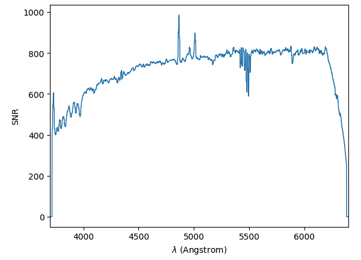
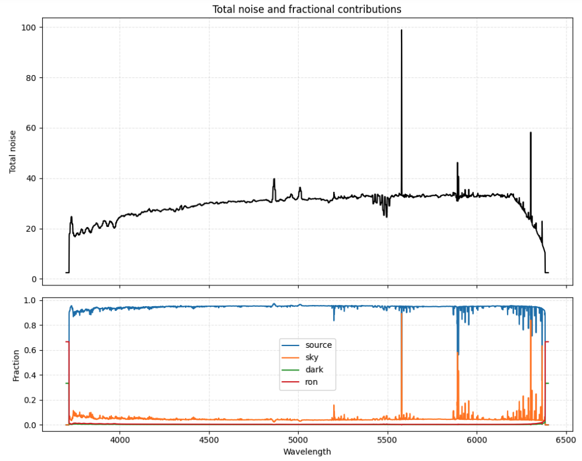

# pyetc_wst

Exposure Time Calculator (ETC) for the Wide-Field Spectroscopic Telescope (WST).

## Description

**pyetc_wst** is a Python package for exposure time calculation and signal-to-noise ratio (SNR) estimation for the WST instrument suite, including:

- **IFS** (Integral Field Spectrograph): Blue and Red channels
- **MOS-LR** (Multi-Object Spectrograph Low Resolution): Blue, Green, Yellow, and Red channels  
- **MOS-HR** (Multi-Object Spectrograph High Resolution): Blue, Green, Yellow, and Red channels

## Requirements

[ All of them can be installed via `pip` ]
- Python >= 3.9
- numpy >= 1.20.0
- scipy >= 1.7.0
- matplotlib >= 3.3.0
- astropy >= 5.0.0
- mpdaf >= 3.5.0
- skycalc_cli

```
pip install "numpy>=1.20.0" "scipy>=1.7.0" "matplotlib>=3.3.0" "astropy>=5.0.0" "mpdaf>=3.5.0" "skycalc_cli"
```

## Installation

### From GitHub

You can install directly from GitHub using pip:

```bash
pip install git+https://github.com/ferromatteo/pyetc_wst.git
```

If you already have it installed via pip, you can upgrade it with:

#### Option 1: forced (recommended)
```bash
pip install --force-reinstall git+https://github.com/ferromatteo/pyetc_wst.git
```

#### Option 2: normal upgrade
```bash
pip install --upgrade git+https://github.com/ferromatteo/pyetc_wst.git
```

#### Option 3: uninstall and reinstall (cleanest option)
```bash
pip uninstall pyetc_wst
pip install git+https://github.com/ferromatteo/pyetc_wst.git
```

## Quick Start

```python
from pyetc_wst import WST

# Initialize the ETC, 'DEBUG' will allow you to see useful prints during the computation,
# skip_dataload = False will load the static sky configurations + general transmissions
wst = WST(log = 'DEBUG', skip_dataload = False)

# Display instrument information
wst.info()

# Access specific instruments
ifs_blue = wst.ifs['blue']
moslr_red = wst.moslr['red']
moshr_yellow = wst.moshr['yellow']

# Build the full dictionaries needed for computation (full_obs), which will include observing conditions, source properties, computation requests, and instrument configuration
full_obs = {...}
con, ob, spe, im, spe_input = wst.build_obs_full(full_obs)

# Compute time or snr given the full dictionary results

# for SNR:
res_snr = wst.snr_from_source(con, im, spe, debug=True/False)

# for SNR at a specific wavelength:
res_snr_at_wave = wst.snr_at_wave(con, im, spe, debug=True/False)

# for time/exposures/best combination
res_time = wst.time_from_source(con, im, spe, compute = 'dit'/'ndit'/'best', debug=True/False)

# --- SNR in a spectral window ---
from pyetc_wst.etc import snr_in_window
# Get median SNR in [5000, 6000] Å from a snr_from_source result
med = snr_in_window(res_snr, lam1=5000, lam2=6000)

# --- Find NDIT for target median SNR in a window ---
result = wst.time_from_source_window(con, im, spe,
                                     lam1=5000, lam2=6000,
                                     target_snr=10,
                                     compute='ndit')
print(f"Required NDIT: {result['ndit']}, achieved median SNR: {result['median_snr']:.2f}")
# The full snr_from_source result is in result['res']
```
`debug=True/False` allows to print detailed info of the current run.

**NOTE**: *`time_from_source()` basically update the 'dit', 'ndit' or both values in the obs. dictionary to the value/values needed to reach a specific SNR at a specific wavelength, after it you could run a `res_snr = wst.snr_from_source(con, im, spe)` and plot the SNR to check the results.*

A full_obs dictionary should look like this (detailed information are given in the file **encoding.txt**):
```python
full_obs = {
    "INS": "moslr",
    "CH": "red",
    
    "NDIT": 1,
    "DIT": 600, 
    
    "SNR": 5,
    "Lam_Ref": 5000,
    
    "OBJ_FIB_DISP": 0,
    
    "PWV": 10,
    "FLI": 0.5,
    "MOON_SEP": 45,
    "SEE": 0.8,
    "AM": 1.2,
    "SKYCALC": False,
    "GLAO": False,   # set True to enable Ground Layer AO mode
    
    "Obj_SED": 'template',
    "SED_Name": 'MARCS_8000K_lg+45',
    "UPLOAD_FILE": "path/to/spec.txt"
    
    "OBJ_MAG": 15, #can be None for loaded spectrum
    "MAG_SYS": 'Vega',
    "MAG_FIL": 'V',
    
    "Z": 0,
    "BB_Temp": 9000.,
    "PL_Index": None,
    
    "SEL_FLUX": 50e-16,
    "SEL_CWAV": 8000,
    "SEL_FWHM":20,
    
    "Obj_Spat_Dis": 'resolved',
    
    "IMA": 'moffat',
    
    "IMA_FWHM": 0.5,
    "IMA_BETA": 2.5,
    
    "Sersic_Reff": 1,
    "Sersic_Ind": 3,
    
    "COADD_WL": 10,
    
    "COADD_XY": 1, #(all integer numbers or 'best')

    # SNR window: target median SNR over a wavelength range instead of at a single reference
    # wavelength. Applies to compute='dit', 'ndit', 'best'. Ignored for line sources.
    "SNR_RANGE": False,  # set True to enable window-based SNR targeting
    "LAM_WIN1": 5000,    # window start in Å
    "LAM_WIN2": 6000,    # window end in Å
}
```
**NOTE**: *"COADD_XY": 'best' — automatically selects the spatial coadding that maximizes the SNR. Like the compute options in `time_from_source`, it updates "COADD_XY" in the obs dictionary with the chosen value.*

**NOTE (3)**: *`"SNR_RANGE": True` — when set, `time_from_source` targets the median SNR over the wavelength window `[LAM_WIN1, LAM_WIN2]` instead of the SNR at `Lam_Ref`. Works for `compute='dit'`, `'ndit'`, and `'best'` (which internally uses `'ndit'`). Line sources (`Obj_SED='line'`) always use their line-center wavelength and ignore this flag. The window is automatically clipped to the instrument spectral range if it extends beyond it.*

**NOTE (2)**: *When using `"Obj_SED": "upload"`, you must provide `"UPLOAD_FILE": "/path/to/spectrum.dat"` pointing to a two-column ASCII file/FITS table (wavelength, flux). Optional comment headers (or "units" of the FITS columns) set units: `# nm` or `# aa` for wavelength (default: Å - `aa`), `# fl` or `# ph` for flux (default: erg/cm²/s/Å - `fl`). Set `"OBJ_MAG": null` to use the spectrum as-is, or set a numeric value (e.g. `18`) to normalize it to that magnitude in the chosen `MAG_FIL`/`MAG_SYS` band.*

After the computation results can be plotted easily accessing the mpdaf `Spectrum` objects in the results dictionary like this:
```python
res_snr['spec']['snr'].plot()
```


or
```python
res_snr['spec']['nph_source'].plot()
```

In general the results of the snr computation `res_snr` will have a main dictionary `res_snr['spec']` which contains several sub-dictionaries, all related to the 
integration in the aperture area for the MOS, and the requested `COADD_XY x COADD_XY` for the IFS (which has also another dictionary `res_snr['peak']`) for the central pixel value.

These sub-dictionaries include:
- 'nph_source': photon from source
- 'nph_sky': photon from sky
- 'snr': snr in the aperture/integration area
- 'snr_rebin': snr in the aperture/integration area, rebinned with COADD_WL
- 'simulated_counts': 1D extracted raw spectrum
- 'noise': another dictionary with noise components and their fractions
  - 'tot'
  - 'frac_source'
  - 'frac_sky'
  - 'frac_dark' 
  - 'frac_ron'

For MOS runs, `res_snr['input']` also includes:
- `'fiber_injection'`: fiber injection fraction (1.0 for surface brightness, computed for point/resolved sources)
- `'total_trans'`: total transmission used in plots/results. For MOS it is `instrument x atmosphere x fiber_injection`.

Moreover, there is a handy function to plot all the noise components together, and will accept `res_snr['spec']['noise']` (and also `res_snr['peak']['noise']`) for IFS): 

```python
plot_noise_components(res_snr['spec']['noise'])
```


## Notebook
`WST_LimMag.ipynb`: computes the limiting magnitude of the WST Integral Field Spectrograph (IFS) as a function of wavelength, for both point sources and extended sources (surface brightness), across the blue and red channels.
For a given target S/N ratio, the notebook sweeps the wavelength range and finds — via Brent's root-finding method — the faintest AB magnitude detectable under three sky background conditions: dark, grey, and bright time.


## Documentation

update in future version

## Citation

This package has been developed from the original `pyetc` package available at https://github.com/RolandBacon/pyetc

update in future version

## Version

### 1.4 — 28 May 2026
- **GLAO support**: new `"GLAO": True` key in the obs dictionary activates Ground Layer Adaptive Optics mode. IFS uses a wavelength-dependent IQ formula `IQ_glao(λ) = (A·λ_nm² + B·λ_nm + C)·AM^0.6` (λ_nm = wavelength in nm; A=1.22465e-7, B=−0.000576386, C=0.717164). MOS overrides the natural seeing to a fixed 0.8 arcsec (Paranal median at zenith, 5000 Å). Moffat beta updated: default (non-AO) **2.50 → 2.80**; IFS-GLAO uses **β = 2.5**.
- **25 SWIRE galaxy/AGN spectral templates** added to the SED library: ellipticals (Ell2/5/13), spirals (Sa/Sb/Sc/Sd/Sdm/S0/Spi4), starbursts (M82/N6090/N6240/Arp220/I19254/I20551/I22491), Seyferts (Sey18/Sey2), QSOs (QSO1/QSO2/BQSO1/TQSO1/Mrk231), and Torus.
- **`snr_in_window(res, lam1, lam2, dlbda, unit, stat)`**: new public utility function that extracts the median (or mean) SNR in a wavelength window from a `snr_from_source` result (SNR per spectral pixel).
- **`ETC.time_from_source_window(ins, ima, spec, lam1, lam2, target_snr, unit, compute, n_iter)`**: new iterative method that finds the DIT or NDIT required to reach a target median SNR (per spectral pixel) inside a user-defined wavelength window [λ1, λ2]. Returns `ndit_raw` (pre-ceil float) alongside the ceiled integer.
- **NDIT rounding unified to `ceil`**: all compute paths (`dit_snr`, `best`, `time_from_source_window`) consistently use `max(1, int(np.ceil(...)))` — if 7.1 exposures are needed, the result is always 8.
- **Web interface**: GLAO toggle, spectral window inputs (λ₁/λ₂) for window-based exposure time computation, improved ASCII/JSON config downloads with timestamped filenames (`wst_..._YYYYMMDD_HHMMSS`), `GLAO`/`SNR_WIN`/`LAM_WIN1`/`LAM_WIN2` included in saved config, SNR window shown in input summary instead of reference wavelength, and consistent NDIT rounding messages showing `"X.XXXX, updating to Y for computation."` in all paths.
- **`time_from_source_window` convergence improved**: max iterations raised to 20; convergence criterion changed to SNR-relative tolerance `1e-4` (0.01%); NDIT sub-1 case exits after one exact analytical step; no artificial floor on `param_val` during iteration.
- **API JSON response**: `snr_window` field added when `SNR_WIN=True`, reporting `median_snr_pixel` and (if `COADD_WL>1`) `median_snr_rebin` in the requested wavelength window.
- **Web results**: window mode now shows both rebinned and per-pixel median SNR (when `COADD_WL>1`) in all compute modes (`dit_snr`, `ndit_snr`, `best`), consistent with non-window behaviour.
- **Emission line SNR window override**: for `Obj_SED="line"`, the SNR spectral window is now automatically ignored in all compute modes (DIT/NDIT, DIT&SNR, NDIT&SNR, Best) — `SNR_WIN` is forced to `False` and `SEL_CWAV` always takes priority as the sole reference wavelength. A warning message is printed in the debug output when the override occurs. The web interface hides and unchecks the SNR window controls whenever the SED type is set to `"line"`.

### 1.3 — 14 May 2026
- Migrated sky background retrieval from `skycalc_ipy` to `skycalc_cli` (official ESO CLI package): sky model data now accessed via `skm.data` attribute and parsed with `Table.read(BytesIO(skm.data), format='fits')`.
- Fixed FITS column names: `skycalc_cli` v1.4 returns lowercase column names (`lam`, `flux`, `trans`) — updated in `etc.py` (`get_sky()`).
- Replaced deprecated `pkg_resources` with `importlib.resources` in `specalib.py` for Python 3.9+ compatibility.
- Removed invalid PWV value `0.01` from the allowed grid (SkyCalc minimum is `0.05`); previously this caused SkyCalc to reject the entire request.
- Fixed false `MAG_SYS` validation error raised for emission-line sources (`Obj_SED="line"`): the check is now skipped when the SED type is `"line"` or `OBJ_MAG` is `None`, since magnitude normalisation is not used in those cases.

### 1.2 — 29 April 2026
- Fixed SkyCalc sky background retrieval: bypassed `skycalc_ipy.get_sky_spectrum()` to call `SkyModel` directly and read the returned FITS HDUList with an explicit `format='fits'` argument, resolving an `IORegistryError` from newer astropy versions that can no longer auto-detect the format of an in-memory HDUList. Moon altitude is derived from the moon-target separation and target zenith distance (`z_moon = ρ + z_target`), which always satisfies the SkyCalc constraint `|z − z_moon| ≤ ρ ≤ z + z_moon` for all airmasses.

### 1.1 — 24 April 2026
- Added MOS fiber injection fraction (`fiber_injection`) to exported inputs/results.
- Updated MOS total throughput to include fiber injection fraction (fiber inj. frac.) in addition to instrument and atmosphere.
- Consolidated recent fixes (RON handling updates, surface-brightness/MOS corrections, and sky-area term consistency updates).
- Improved configuration/info tracking text for throughput model metadata.
- Added moon-target separation as a user-settable parameter (`MOON_SEP`, default 45°); previously fixed at 45° internally.
- Fixed MOS object displacement validation range: now correctly 0–0.6 arcsec (previously rejected values above 0.3 arcsec).

### 1.0 — 9 March 2026
- Official release of the WST Exposure Time Calculator.
- Throughput curves (all channels) delivered by Olga Bellido (WST System Engineer).
  
## Contact

Matteo Ferro - [matteo.ferro@inaf.it]

Project Link: [https://github.com/ferromatteo/pyetc_wst](https://github.com/ferromatteo/pyetc_wst)
